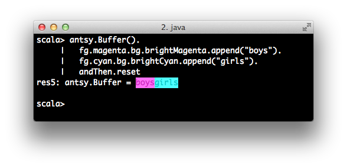

# antsy

ansi escapism for scala

# usage

A work in progress. The gist is that [ansi escaped](http://en.wikipedia.org/wiki/ANSI_escape_code) text in scala
should be a little more composable than

```scala
Console.BLINK + Console.RED + "aleerrt" + Console.RESET
```

Escape sequences are constants in `antsy.Term` which you can access the same way you do with the ones
available in `scala.Console`

You can compose escape sequences and text with immutable `antsy.Buffers`


Buffers are meant to be appenable and chainable. Unike `java.lang.Appendable`, whose interfaces return Unit, Buffers implements an `java.lang.Appendable`-like interface `Appends[T]` where append operations return type `T`. 

```scala
val b: antsy.Buffer = antsy.Buffer().append("appended")
```

A `Buffer`s `toString` implementation returns a printable string containing escape sequences.


### Colors

A `Buffer` exposes colors through the `fg` ( foreground ) and `bg` ( background ) methods. From either ground you can call `fg` or `bg` to switch grounds or call `andThen` to return the default context. Escape sequences defined in `antsy.Term` are exposed as methods on `Buffer` which simply append. This interface is meant to be infinitely chainable so you can compose both colors and text.


```scala
antsy.Buffer()
  .fg.magenta.bg.brightMagenta.append("boys")
  .fg.cyan.bg.brightCyan.append("girls")
  .andThen.reset
```



### Styles

A `Buffer` exposes styles like bold, italic, underline, and inversion as methods.

For bold styles...

```scala
antsy.Buffer()
  .bold.append("loud")
  .noBold.append("soft")
  .reset
```

For italics...

```scala
antsy.Buffer()
  .italic.append("emphaize")
  .noItalic.append("std")
  .reset
```

For underlines...

```scala
antsy.Buffer()
  .underline.append("remember me")
  .noUnderline.append("skim over me")
  .reset
```

For inversion of styles...

```scala
antsy.Buffer()
  .invert.append("beep")
  .unvert.append("boop")
  .reset
```

That's it.

Doug Tangren (softprops) 2013
