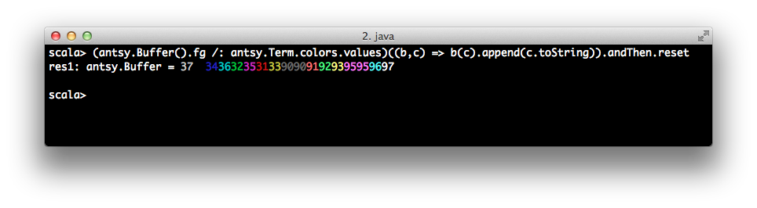

# antsy

ansi escapism for scala

# usage

A work in progress. The gist is that ansi escaped text in scala
should be a little more composable than

```scala
Console.BLINK + Console.RED + "aleerrt" + Console.RESET
```

Escape sequences are constants in `antsy.Term` which you can access the same way you do with the ones
available in `scala.Console`


You can compose escape sequences and text with immutable `antsy.Buffers`



Doug Tangren (softprops) 2013
